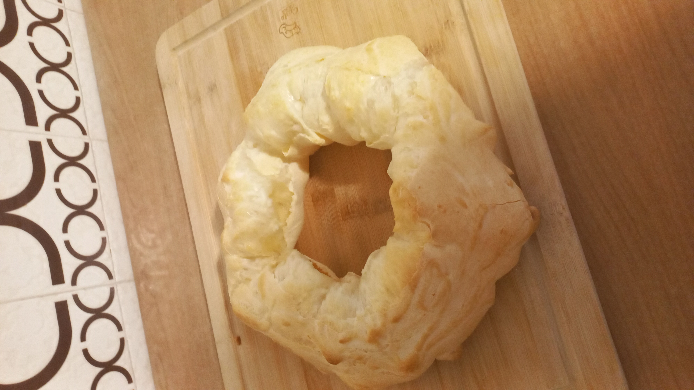

---
tags:
  - ⏱️ 40 min
  - 🟢 Fácil
  - ❤️ Receita de Mãe
---

# Rosca de Polvilho Joinvillense

## Ingredientes

- 1 ovo
- 1/2 xícara de óleo
- 1/2 xícara de leite
- 2 xícaras de polvilho azedo
- Água morna (suficiente até dar o ponto)
- Sal a gosto.

## Receita: 

- Bater bem o ovo, o leite e o óleo.
- Juntar as 2 xícaras de polvilho azedo e misturar até virar uma farofa.
- Juntar aos poucos água morna até dar o ponto.
- Agora é só assar e se deliciar 🥰😘

