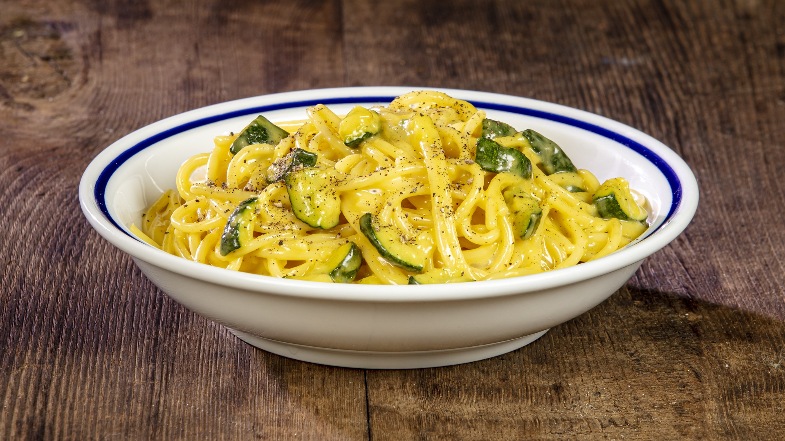

---
tags:
  - ⏱️ 20 min
  - 🟢 Facile
---

# Carbonara di Zucchine

## Ingredienti (per 4 persone)

* 400g di spaghettoni
* 500g di zucchine fiorentine
* 3 tuorli d'uovo
* 80g di pecorino stagionato
* 50g di Parmigiano Reggiano
* 2 spicchi di aglio
* 1 pizzico di prezzemolo fresco tritato
* Olio extravergine di oliva
* Buccia di limone bio
* Pepe

## Ricetta

1. Mettete sul fuoco una pentola de acqua, portatela a ebollizione e aggiungete un pugnello di sale grosso.
2. Intanto lavate e tagliate a rondelline le zucchine.
3. Versate 4 cucchiaiate di olio in una padella capiente. Unite l'aglio schiacciato e mettetela sul fuoco.
4. Appena l'aglio prenderà colore, aggiungete le zucchine, aggiustate di sale e fate rosolare a fiamma bassa, rigirandole via via.
5. Buttate la pasta, abbassate il fuoco e fatela cuocere, ma raccomando al dente.
6. Nel frattempo, in una ciotola, mascolate i tuorli con il formaggio allungando la crema ottenuta con una tazzina di acqua di cottura.
7. Scolate la pasta e versatela per un minuto.
8. Spengete il fuoco e, a questo punto, unite la crema di uova sempre rigirando ben bene con una forchetta e unendo infine prezzemolo e buccia di limone tritati finissimi.
9. Se serve, aggiungete un po' di acqua calda per creare una cremina densa e avvolgente.
10. Aiutandovi col romaiolo e le pinze, formate nelle scodelle un bel nido di pasta, nappatela col sugo di zucchine e rifinitela con una spolverata di pepe.
11. Subito in tavola. è buona caldissima!

