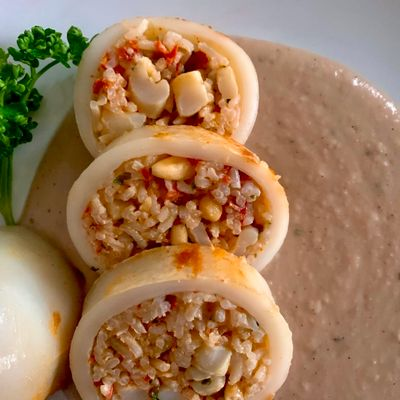

---
tags:
  - ⏱️ 30 min
  - 🟡 Media
---

# Calamari Ripieni di Riso al Pomodoro e Pinoli

## Ingredienti (per 6 persone)

- 12 calamari già puliti
- 150g di riso Basmati
- 2 cucchiai di uvetta
- 3 cucchiai di pinoli
- 1 cipolla bianca
- 1 spicchio d'aglio
- 3-4 rametti di prezzemolo
- Olio extravirgine di oliva
- Sale e pepe

Per il sugo:

- 400g di passata rustica di pomodoro
- 1 spicchio d'aglio
- 1 scalogno
- Basilico
- Olio extravirgine di oliva
- Sale

## Ricetta: 

- Mettete in ammollo in acqua 15 struzzicadenti per 30 minuti.
- Cuocete al dente il riso in acqua salata e preparate il sugo.
- In un tegame fate appassire, con un filo d'olio, lo scalogno e l'aglio tritati.
- Aggiungete la passata e il basilico, regolate di sale, coprite e cuocere per 10 minuti.
- Tritate finementre i tentacoli dei calamari, la cipola e l'aglio.
- In una padella versate un po' d'olio e fate imbiondire la cipolla e l'aglio.
- Aggiungete i tentacoli e cuocete per 3-4 minutii.
- Versate i tentacoli nel riso scolato, aggiungete il prezzemolo tritato, l'uveta ammoliata e strizzata, 3/4 dei pinoli tostati e un pizzico di pepe.
- Con il composto farcite i calamari e chiudeteli con gli stuzzicadenti, quindi fateli dorare velocemente con un filo di olio in un tegame adatto anche per il forno.
- Cospergete con il sugo e infornate a 190ºC per 15 minuti.
- Servite con un trito di prezzemolo e i pinoli tostati.

