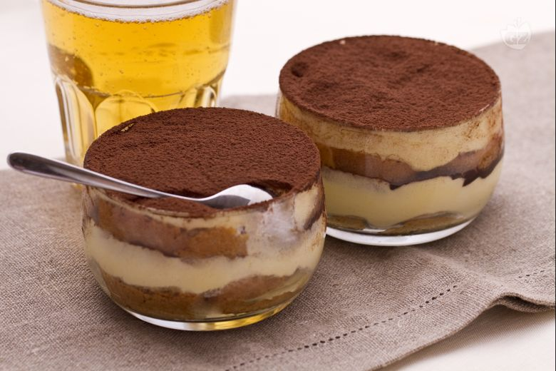

---
tags:
  - ⏱️ 15 min
  - 🟡 Media
---

# Tiramisù alla birra

## Ingredienti (per 4 persone)

- 20 savoiardi
- 4 cucchiai di cacao amaro in polvere
- 150g di mascarpone
- 120ml di panna fresca
- 70g di zucchero
- 3 tuorli
- 30ml di birra bionda

Per la bagna:

- 100ml di caffè della moka
- 20g di zucchero
- 100ml di birra bionda

## Ricetta: 

- Una volta preparato il caffè, fatevi sciogliere lo zucchero e lasciate che si raffredi.
- Nel frattempo fate bollire per 1 minuto i 100ml di birr, lasciateli raffreddare, quindi aggiungeteli al caffè.
- montare per 4-5 minuti i tuorli con lo zucchero fino a ottenere un composto gonfio e chiaro.
- Incorporate con le fruste i 30ml di birra, poi cuocete a bagnomaria per 6-7 minuti finché otterrete una crema densa e corposa, oppure fino a raggiungere i 62ºC (servitevi di un termometro da cucina).
- Quando lo zabaione sarà freddo, incorporate il mascarpone.
- Montate la panna e unitela delicatamente al composto.
- Assemblate i bicchieri con un primo strato di savoiardi bagnati nel caffè alla birra, formate uno strato di crema e spolverizzate con il cacao.
- Ripetete gli strati all stesso modo fino a completare i bicchieri e decorate con una spolverizzata di cacao solo poco prima di servire.

